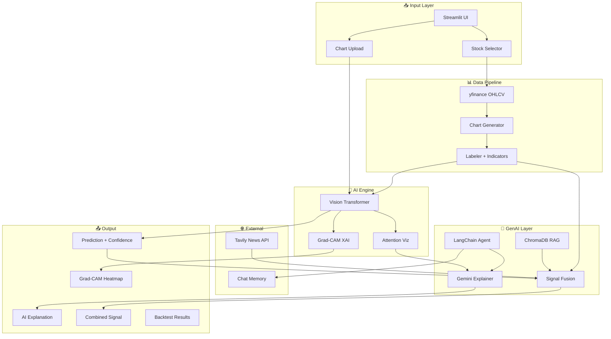

# Architecture — Hybrid ViT Stock Trend Predictor

## System Overview



## Component Architecture

### Data Pipeline (`src/data/`)
| File | Purpose |
|------|---------|
| `collect_data.py` | Downloads OHLCV data from Yahoo Finance for 8 stocks |
| `generate_charts.py` | Creates 224×224 candlestick chart images with sliding window |
| `label_data.py` | Computes forward returns, RSI, MACD, assigns labels, splits data |

### Model (`src/model/`)
| File | Purpose |
|------|---------|
| `vit_model.py` | ViT backbone (timm) + hybrid classification head for chart + indicators |
| `train.py` | Training loop with AdamW, CosineAnnealingLR, early stopping |
| `evaluate.py` | Test set evaluation, confusion matrix, classification report |
| `inference.py` | Single-image prediction with fallback mode |

### XAI (`src/xai/`)
| File | Purpose |
|------|---------|
| `gradcam.py` | Grad-CAM adapted for ViT — heatmap overlay generation |
| `attention_viz.py` | Attention weight extraction and natural language description |

### GenAI (`src/genai/`)
| File | Purpose |
|------|---------|
| `explainer.py` | Gemini-powered plain-English explanations |
| `rag_patterns.py` | ChromaDB with 15 classic candlestick patterns |
| `signal_fusion.py` | Weighted combination: ViT(40%) + RAG(20%) + News(25%) + Tech(15%) |
| `analyst_agent.py` | LangChain agent with 5 tools and Gemini backbone |

### Memory (`src/memory/`)
| File | Purpose |
|------|---------|
| `chat_memory.py` | Sliding window memory, interest tracking, personalization |

### Backtesting (`src/backtesting/`)
| File | Purpose |
|------|---------|
| `backtest.py` | Up→Buy, Down→Sell strategy with equity curve and Sharpe ratio |

### Evaluation (`src/evaluation/`)
| File | Purpose |
|------|---------|
| `llm_judge.py` | Gemini-based scoring of explanations (accuracy, clarity, alignment) |

### Frontend (`app/`)
| File | Purpose |
|------|---------|
| `app.py` | Main Streamlit app with sidebar and session state |
| `pages/1_Analyze_Chart.py` | Full analysis pipeline UI |
| `pages/2_Chat.py` | Agent chat with memory |
| `pages/3_Backtest.py` | Backtesting dashboard |
| `pages/4_Performance.py` | Model metrics and LLM judge scores |

## Data Flow

```
1. Raw Data → yfinance API
2. OHLCV CSVs → Candlestick Images (224×224)
3. Images + RSI + MACD + trend score + labels → Labeled Dataset (train/val/test)
4. Dataset → Hybrid ViT Training (Kaggle/Colab GPU)
5. Trained Model → Inference → Prediction + Confidence
6. Prediction → Grad-CAM + Attention → Explainability
7. All Signals → Fusion Engine → Combined Signal
8. Agent → Tools + LLM → Conversational Interface
```

## Signal Fusion Formula

```
Combined Score = 0.40 × ViT_score + 0.20 × RAG_score + 0.25 × News_score + 0.15 × Tech_score

Where:
  - ViT_score = (P(Up) - P(Down)) × confidence ∈ [-1, +1]
  - RAG_score = weighted avg of pattern bullish scores ∈ [-1, +1]
  - News_score = (bullish_keywords - bearish_keywords) / total ∈ [-1, +1]
  - Tech_score = f(RSI, MACD) ∈ [-1, +1]

Final Signal:
  - score > +0.1 → "Buy"
  - score < -0.1 → "Sell"
  - otherwise → "Hold"
```

## Tech Stack

| Category | Technologies |
|----------|-------------|
| **Data** | yfinance, mplfinance, pandas-ta |
| **Model** | PyTorch, timm (ViT), scikit-learn |
| **GenAI** | Google Gemini, LangChain, ChromaDB, sentence-transformers |
| **News** | Tavily API |
| **Frontend** | Streamlit, Plotly |
| **DevOps** | Docker, GitHub Actions, Render |
